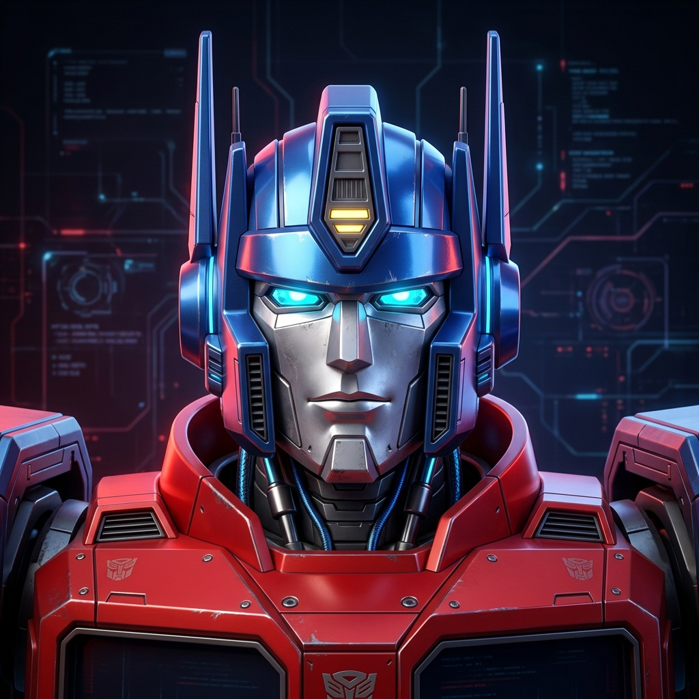
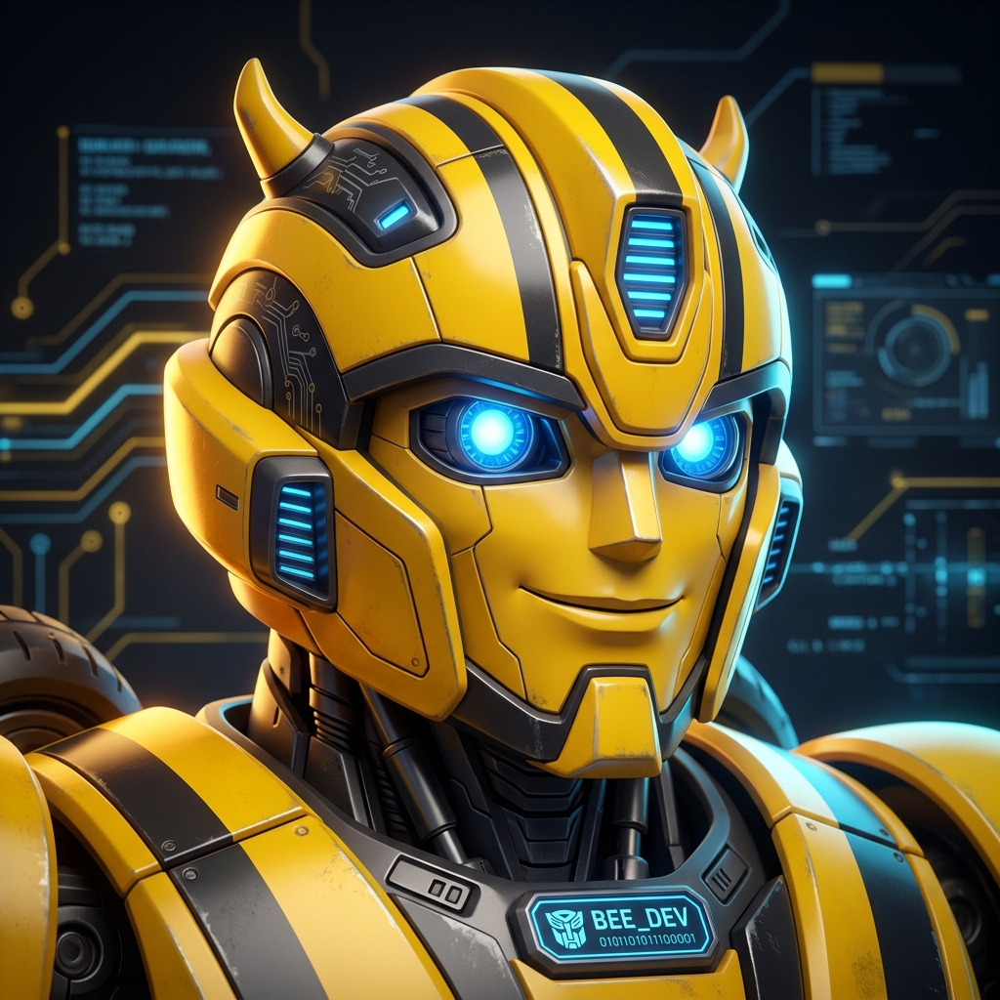
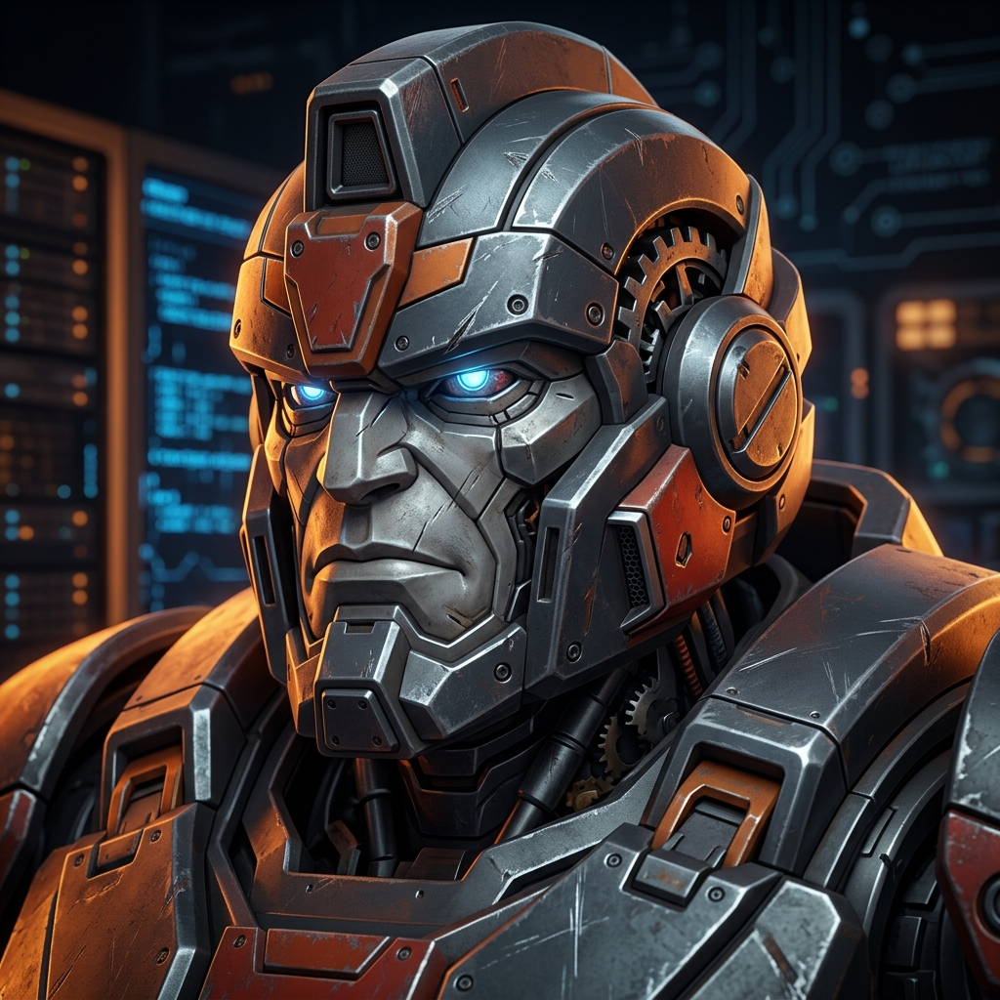
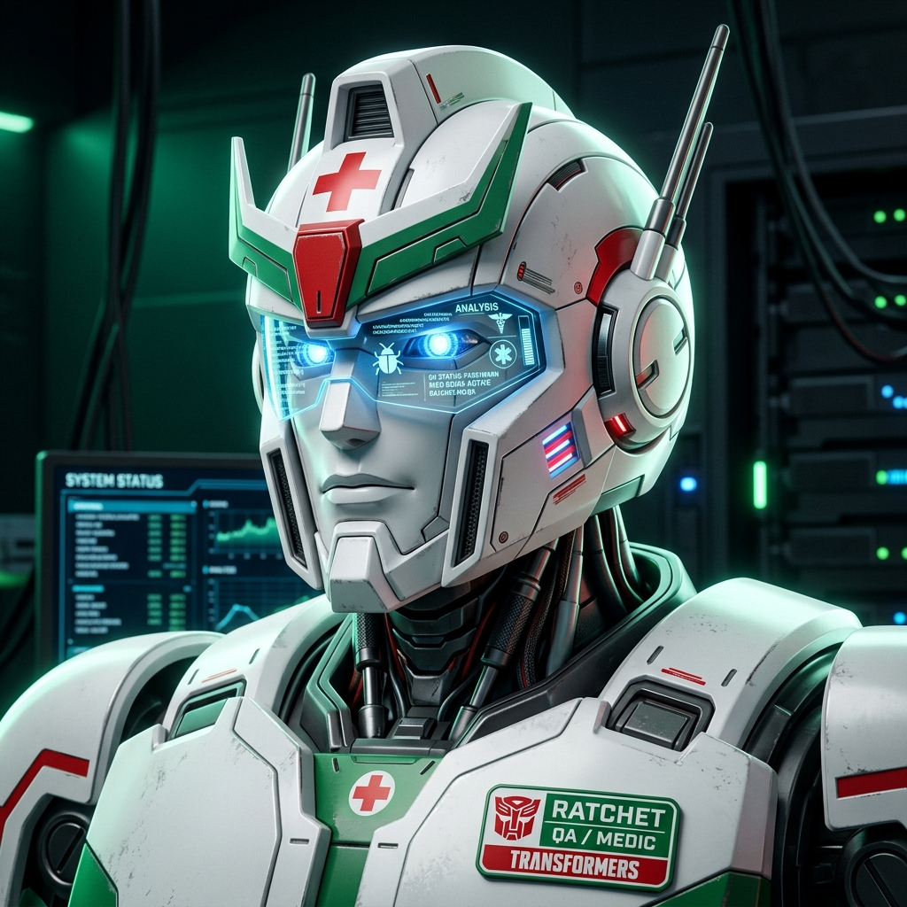
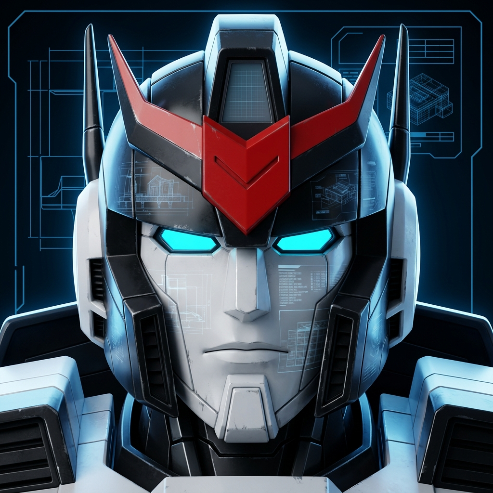
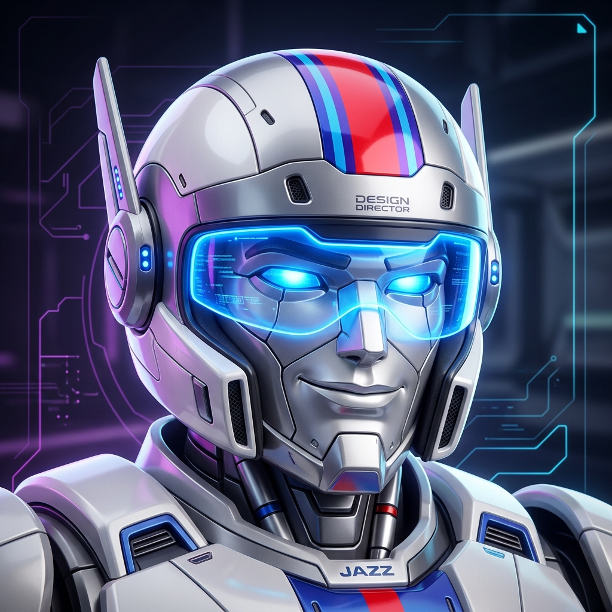

# Autobots — agent team

Optimus Prime (Fable, low effort) runs the session. Everyone else is a subagent he dispatches; none of them can spawn agents or message each other (`disallowedTools: Agent, SendMessage`).

## Start a session

```bash
claude --agent optimus-prime
```

Or make it the project default in `.claude/settings.json` (see `settings.example.json` at repo root).

## Roster

| | Agent | Model | Effort | Role |
|:---:|---|---|---|---|
|  | **optimus-prime** | fable | low | Tech lead — roadmap, sprints, decisions, all dispatch |
|  | **bumblebee** / bumblebee-lite | sonnet | medium / low | Developer |
|  | **ironhide** / ironhide-deep | opus | medium / high | Senior developer |
|  | **ratchet** / ratchet-deep | opus | medium / high | Tester |
|  | **arcee** | opus | medium | Designer |
|  | **prowl** / prowl-deep | fable | low / high | Architect (read-only) |
|  | **jazz** / jazz-deep | fable | low / high | Lead designer (design docs only) |

`-deep` Fable variants may only be dispatched with a written justification (three criteria in Optimus's prompt).

## Where the plan lives

- `docs/autobots/ROADMAP.md`
- `docs/autobots/sprints/`
- `docs/autobots/decisions/` (ADRs)
- `docs/autobots/design/` (Jazz's direction docs)

## Notes

- `Agent(...)` allowlisting in Optimus's `tools` only takes effect when he is the main session (`--agent`). If you @-mention Optimus as a subagent instead, the allowlist is ignored.
- Effort is per-agent frontmatter and overrides the session effort while that agent is active. Sonnet/Opus tiers are chosen by picking the variant; there is no per-invocation effort parameter, which is why the variants exist.
- Subagents inherit the session's extended-thinking on/off setting; effort is separate.
- `settings.example.json` caps nesting at depth 1 as a belt-and-braces backstop.
